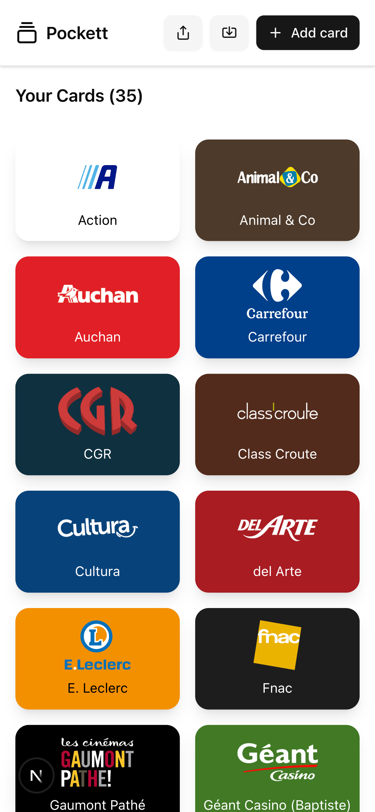
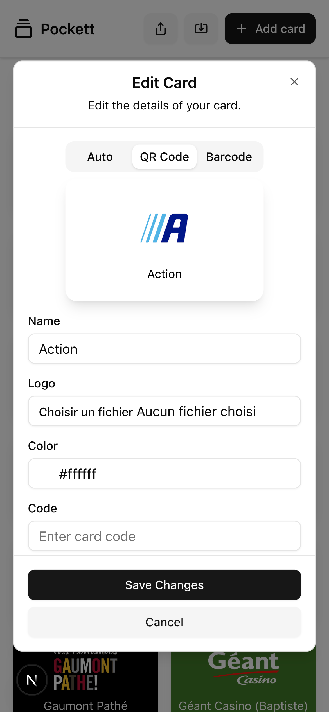

#  Pockett

[](https://nextjs.org/)
[](https://pnpm.io)
[](https://ui.shadcn.com/)
[](LICENSE)

**Pockett** is a sleek, mobile-first Next.js app that keeps all your loyalty cards in your pocket. Add cards on the fly and export them to your mobile wallet when needed.

---

## ✨ Features

- 📱 Responsive UI built with [shadcn/ui](https://ui.shadcn.com)
- 🎟 Store unlimited loyalty cards
- 💳 Export to Apple Wallet / Google Wallet
- 🔐 Uses [addtowallet.co](https://addtowallet.co) for wallet passes
- 🛠 Requires an API key for wallet generation

---

## 🚀 Getting Started

```bash
pnpm install
pnpm dev
```

Open [http://localhost:3000](http://localhost:3000) in your browser to view the app.

Create a `.env.local` file:

```env
ADDTOWALLET_API_KEY=your_api_key_here
```

---

## 📸 Screenshots

<p align="center">
  
  
</p>

---

## 📚 Learn More

- [Next.js Documentation](https://nextjs.org/docs)
- [shadcn/ui Documentation](https://ui.shadcn.com)
- [addtowallet.co API](https://addtowallet.co)

---

## 📦 Deploy on Vercel

Deploy this project instantly with [Vercel](https://vercel.com/new?utm_source=create-next-app&utm_medium=readme):

[](https://vercel.com/new)

---

## 🧾 License

This project is licensed under the [MIT License](LICENSE).

---

Built with ❤️ using [Next.js](https://nextjs.org)
